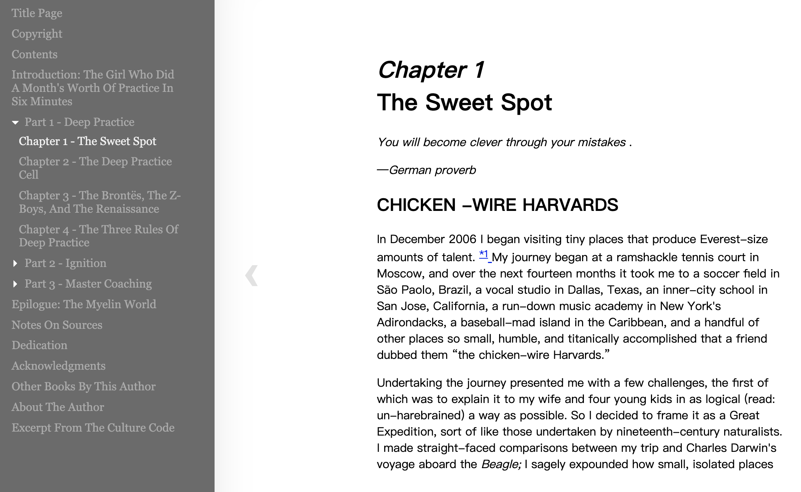
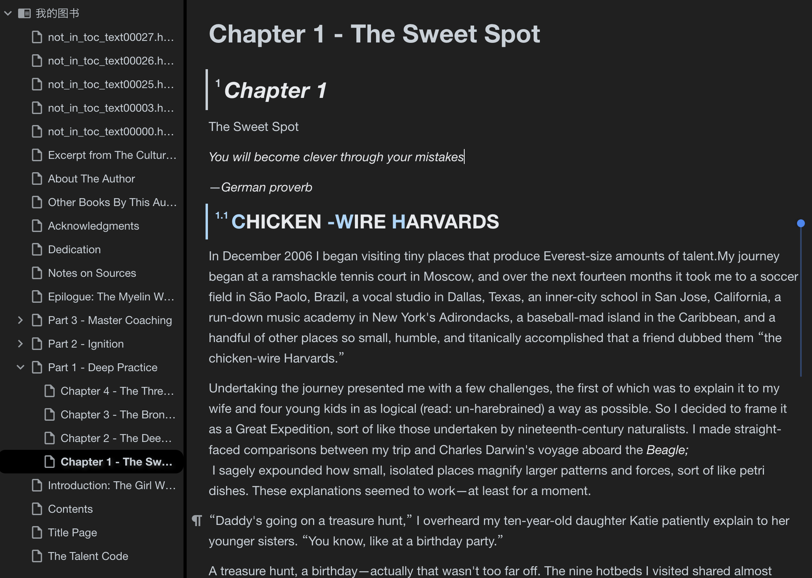

### 简介

思源笔记是一款很好用的笔记工具，但目前不支持 epub 格式电子书导入。在阅读 epub 电子书并笔记时有不便，便编写此小工具，用于导入epub电子书至思源笔记本中，方便阅读及笔记之用。


### 使用方法

- 安装依赖`requirements.txt`，测试环境为`python 3.6`

```terminal
pip install -r requirements.txt
```

- `settings.py` 中填写思源笔记地址`SIYUAN_URL`，如本地笔记为`http://127.0.0.1:6806`，`SIYUAN_TOKEN`在 `设置 - 关于` 里查看 `API token`；

```python

SIYUAN_URL = 'http://127.0.0.1:6806'
SIYUAN_TOKEN = ''

```

- 如`test.py`中所提示：

```python
from epub2note import Epub2note

note = Epub2note(notebook_name='我的图书') # epub 导入笔记本名称，如不存在，则会自动新建
note.gen_note(epub_path='xxx.epub') # epub 电子书路径

```


### 处理

- 原理：epub 电子书实际上格式为 html 格式，此程序先将 epub 电子书转为 Markdown 格式后调用思源笔记 API 使用 Markdown 格式建立笔记
    
- 支持：
    - epub 电子书图片正常显示
    - 大部分电子书的文字格式正常显示
    - 按电子书 toc 目录生成相应目录结构笔记
- 问题：
    - 电子书 toc 目录结构问题会导致导出目录不正确
    - 对于因为目录结构未能正确识别的电子书会统一放在根目录`not_in_toc_xxxx`，需进行手工调整
    - 对于电子书中的点击链接，导入后未能支持点击跳转
    - 电子书部分格式会丢失
    - 因导入思源笔记速度过快，会导致导入目录结构出问题，所以强制连续导入笔记4秒间隔，影响导入速度
    

### 使用截图

- 正常导入封面

- 原电子书目录及格式

- 导入后目录及格式
